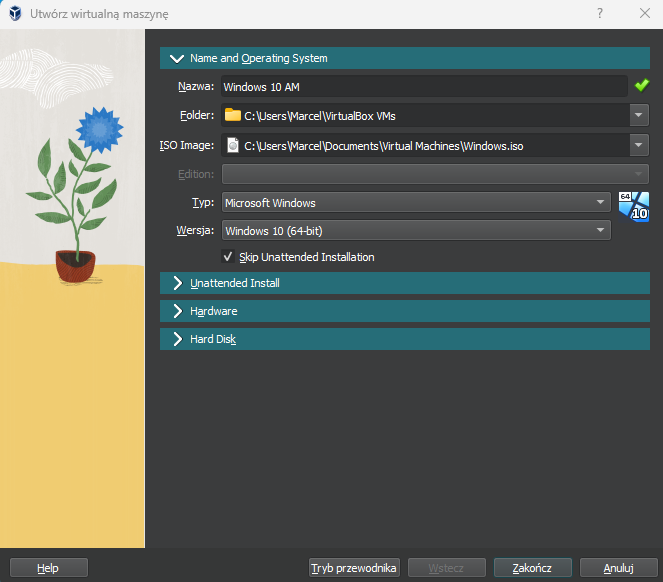
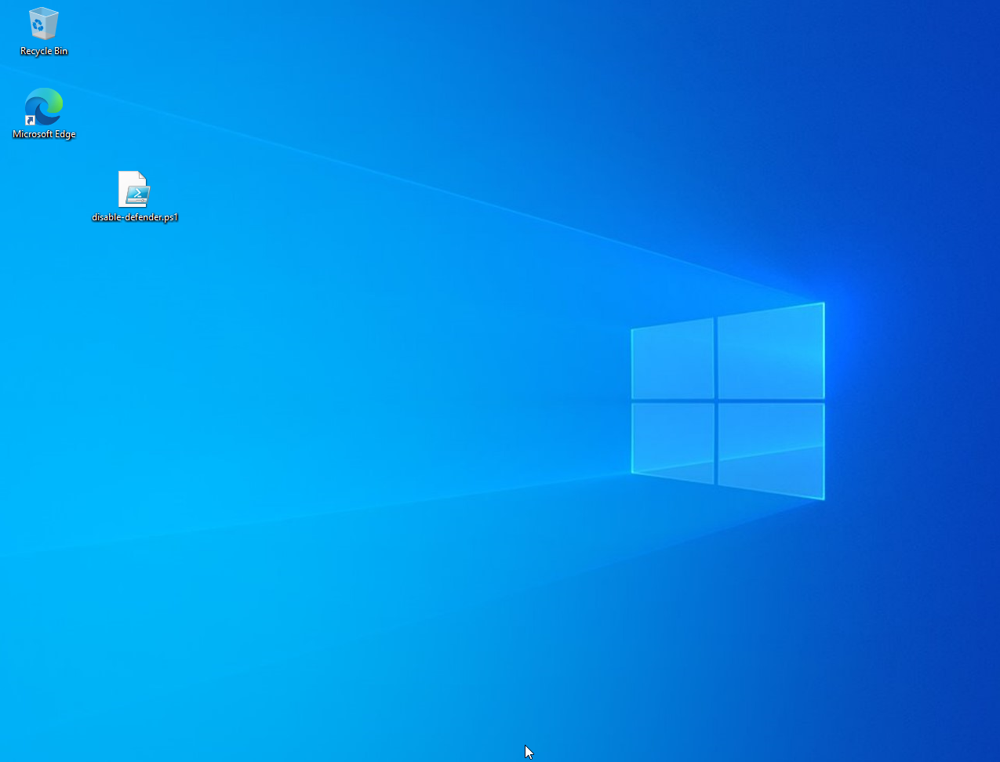
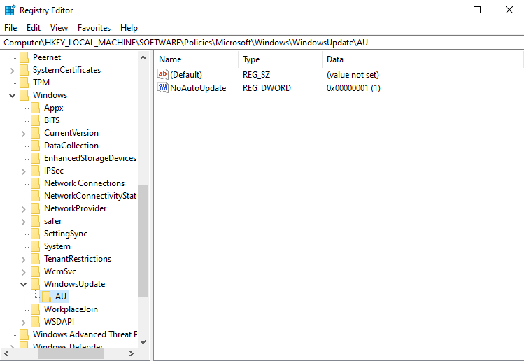
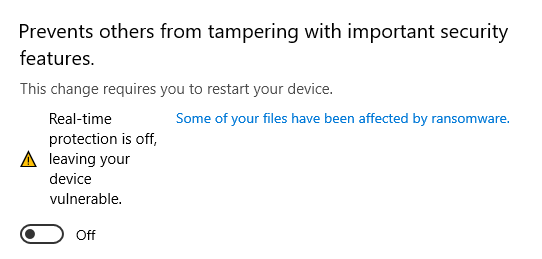
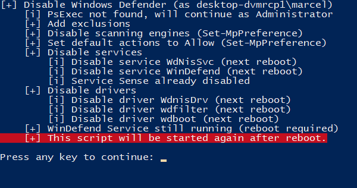
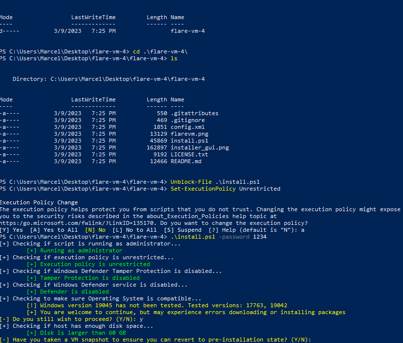
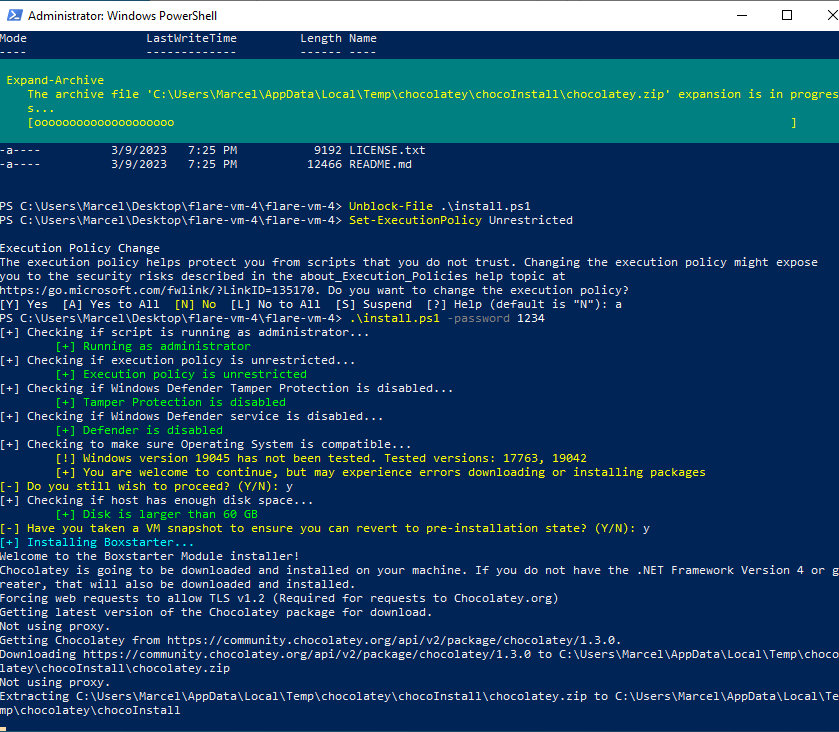
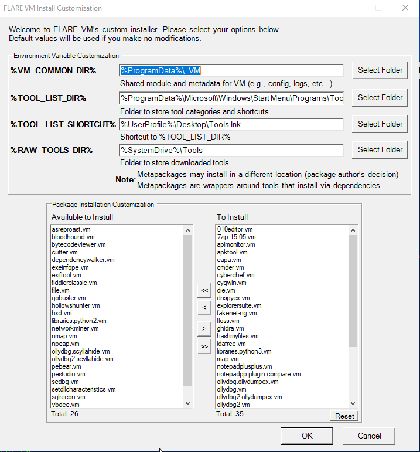
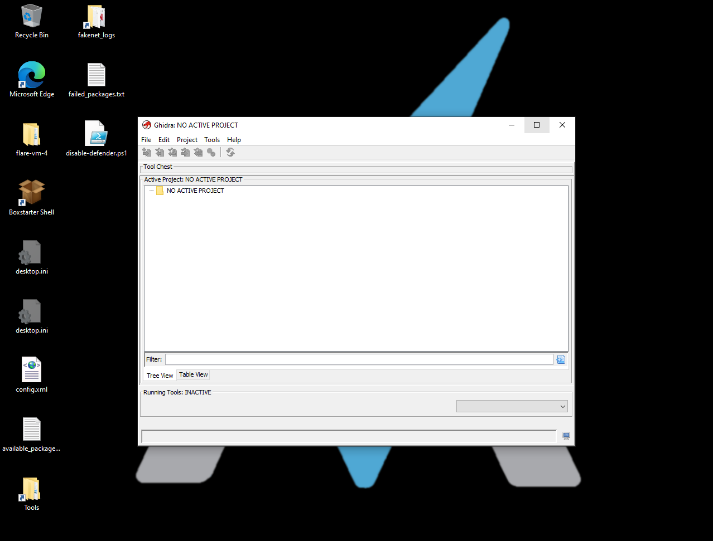
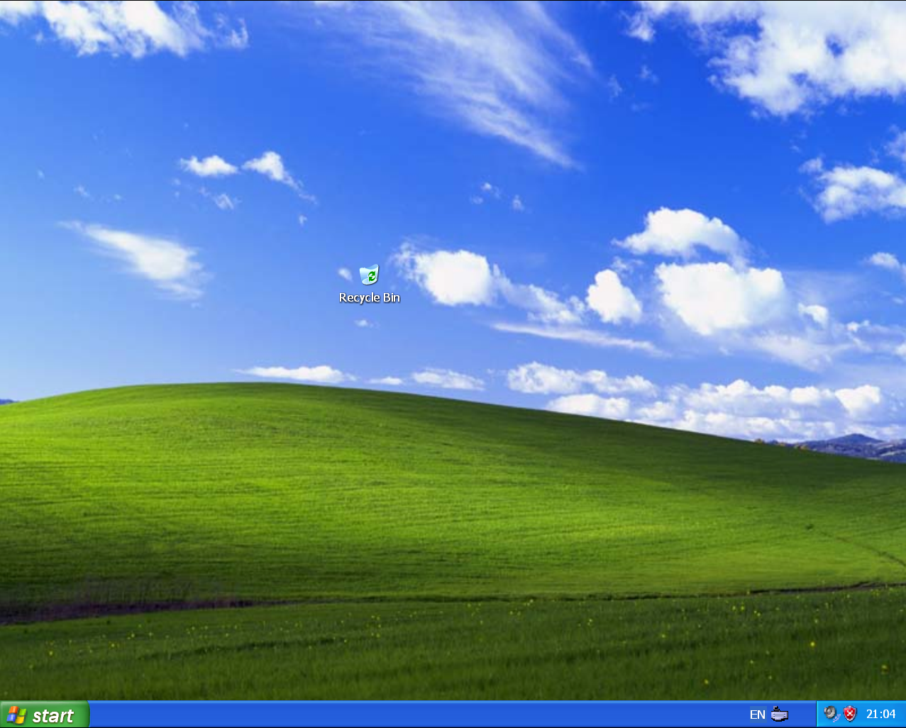

# Przygotowanie środowiska do Analizy Malware

## Instalacja Systemu Windows 10

Dla systemu windows należy przeznaczyć conajmniej 60 GB miejsca na dysku  
Ja przeznaczyłem:

- 80 GB miejsca na dysku
- 8 GB pamięci RAM
- 6 wątków procesora

Następnie należy przejść przez proces instalacji

Po udanej instalacji mamy gotowy system Windows 10

## Instalacja Flare VM

Zanim zainstaluje się środowisko Flare VM, należy przejść przez kilka kroków  

### Wyłączenie Windows Update

Windows Update można wyłączyć na 2 sposoby

- Group Policy Edit (Wymagany Windows Pro)
- Windows Registry

Ja miałem problem z użyciem GPE, dlatego dodałem klucz do rejestru za pomocą [poradnika](https://www.windowscentral.com/how-stop-updates-installing-automatically-windows-10)

### Wyłączenie Tamper Protection

### Wyłaczenie Windows Defender

Ostatnim krokiem przed instalacją Flare VM jest wyłączenie Windows Defendera

Posłużyłem się do tego [skryptem](https://github.com/jeremybeaume/tools/blob/master/disable-defender.ps1), który automatycznie go wyłącza

Skrypt potrzebuje 5 cykli restartowania, aby wyłączyć winodows defender całkowicie

Skrypt powinien bez problemów wyłączyć Windows Defender

### Flare VM

Aby zainstalować Flare VM, sklonowalem repo, wykonałem polecenia z instrukcji instalacji, a następnie włączyłem skrypt

Skrypt upewnia się, że zrobiliśmy migawkę (snapshota) przed instalacją

Skrypt instaluje teraz Boxstartera oraz Chocolatey

Okienko z wyborem narzędzi do zainstalowania

Po wyborze narzędzi została przeprowadzona instalacja narzędzi, która potrwała kilkadziesiąt minut

Po instalacji tak powinno wyglądać gotowe środowisko

## Pozostałe kroki

### Ghidra

Programu Ghidra nie trzeba pobierać, ponieważ został już zainstalowany wraz z Flare VM

### Izolacja Maszyny

Aby malware nie miał dostępu do Hosta należy go od niego jak najbardziej odseparować

## Windows XP

Na potrzeby labów 3+ zainstalowałem również [Windows XP](https://archive.org/details/Windows_XP_Professional_x64.iso)

Do aktywacji użyłem klucza  
B2RBK-7KPT9-4JP6X-QQFWM-PJD6G  
*Klucz działa dla każdej instalacji Windowsa XP*

## Podsumowanie

- Windows Defender wyłączony

- Maszyna FlareVM do analizy malware została zainstalowana bez problemów
  
- Maszyna jest odizolowana od sieci oraz systemu Hosta

- Potrzebne narzędzia zostały zainstalowane

- Windows XP zainstalowany
