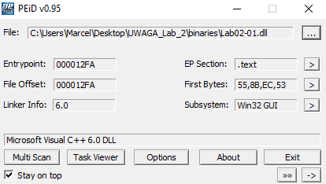
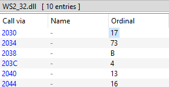
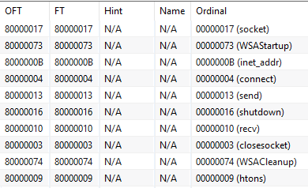
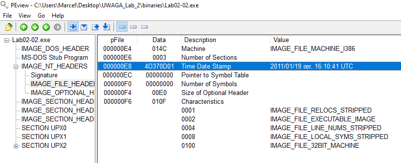
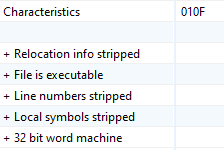
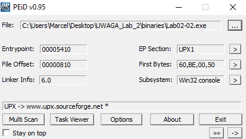
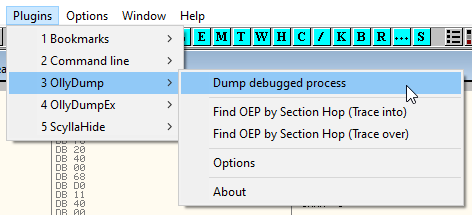
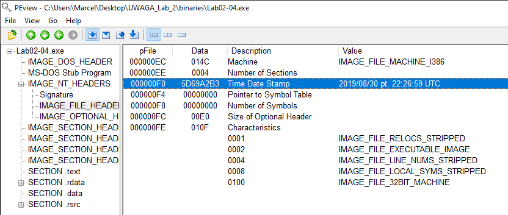

# Laboratorium 2

> formatowanie tekstu  

Na laboratorium 2 przedstawione zostają proste programy do analizy statycznej.  
Programy pokazują w plikach podstawowe informacje takie jak:

- Sumy kontrolne
- Importy
- Zaciemnianie
- Stringi

## Spis treści

- [Laboratorium 2](#laboratorium-2)
  - [Spis treści](#spis-treści)
  - [Sumy kontrolne](#sumy-kontrolne)
  - [Laboratium 1.1](#laboratium-11)
    - [Plik Lab02-01.dll](#plik-lab02-01dll)
    - [Plik Lab02-01.exe](#plik-lab02-01exe)
    - [Podsumowanie](#podsumowanie)
  - [Laboratium 1.2](#laboratium-12)
    - [Plik Lab02-02.exe](#plik-lab02-02exe)
  - [Laboratium 1.3](#laboratium-13)
    - [Plik Lab02-03.exe](#plik-lab02-03exe)
  - [Laboratium 1.4](#laboratium-14)
    - [Plik Lab02-04.exe](#plik-lab02-04exe)
    - [Podsumowanie 04.exe](#podsumowanie-04exe)

## Sumy kontrolne

---

| File Name | MD5 | SHA-256 |
| --------- | --- | ------- |
| Lab02-01.dll | 290934C61DE9176AD682FFDD65F0A669 | F50E42C8DFAAB649BDE0398867E930B86C2A599E8DB83B8260393082268F2DBA |
| Lab02-01.exe | BB7425B82141A1C0F7D60E5106676BB1 | 58898BD42C5BD3BF9B1389F0EEE5B39CD59180E8370EB9EA838A0B327BD6FE47 |
| Lab02-02.exe | 8363436878404DA0AE3E46991E355B83 | C876A332D7DD8DA331CB8EEE7AB7BF32752834D4B2B54EAA362674A2A48F64A6 |
| Lab02-03.exe | 9C5C27494C28ED0B14853B346B113145 | 7983A582939924C70E3DA2DA80FD3352EBC90DE7B8C4C427D484FF4F050F0AEC |
| Lab02-04.exe | 625AC05FD47ADC3C63700C3B30DE79AB | 0FA1498340FCA6C562CFA389AD3E93395F44C72FD128D7BA08579A69AAF3B126 |

## Laboratium 1.1

---

### Plik Lab02-01.dll

1. Na VirusShare plik zosdtał oznaczony 44 razy jako wirus i był już wcześniej analizowany

2. Plik został skompilowany 19 Grudnia 2010 roku

3. Wykorzystując narzędzie PEiD można w łatwy sposób sprawdzić czy program został zaciemniony  
  
I jak widać nie został on zaciemniony, jest to zwykła biblioteka DLL.  
Kiedy obejrzy się ten sam program w PPEE  
znalezienie informacji o tym, że jest to biblioteka DLL nie jest takie oczywiste.  
Na szczęście program wyświetla nam tą informację w File Header  
  
Zrobiłem research, skąd program wie, że jest to biblioteka i natknąłem się na flagi *characteristics*  
Ten plik ma characteristics równe 210E.
Po przeczytaniu dokumentacji [Microsoft PE32 File][1] zauważyłem,  
że flaga 0x2000 oznacza plik DLL.  
  

4. Bilbioteka importuje fukcje z 3 bibliotek:
    - **KERNEL32.DLL**  
    Biblioteka odpowiada za zarządzanie pamięcią, I/O i tworzenie procesów.  
    Do ciekawych importów należą funkcje m. in.
      - CreateProcessA (*tworzy proces*)
      - CreateMutexA (*upewnia się, że tylko jedna instancja malwaru działa w danym momencie*)
      - OpenMutexA (*podobnie jak poprzednia funkcja*)
    - **WS2_32.DLL**  
    Biblioteka odpowiada za połączenie sieciowe TCP/IP i wspiera przy tym m. in. IPv4, IPv6 oraz Bluetooth.  
    Niestety PE-bear nie pokazuje nazw importów.  
        
    Widać jednak Ordinal, czyli numer połączony z nazwą. Nie znalazłem tych liczb w dokumentacji,  
    ale natkąłem się na [skrypt w pythonie][2], który ma wypisane i Ordinals jak i nazwy funkcji.  
    Po przekonwertowaniu liczb z hex na dec uzyskałem nazwy importów.
      - socket
      - inet_addr (*konwertuje adres IP na format do użycia przez funkcję connect*)
      - connect (*łączy z adresem IP*)
      - send (*wysyła pakiet*)
      - recv (*odbiera pakiet*)  
    *Po fakcie zauważyłem, że PPEE automatycznie wyświetla nazwy importowanych funkcji*  
        
    - **MSVCRT.DLL**  
    Jest to C Standard Library dla Visual C++. Niegroźne

5. *Jak wyżej*
6. *Opisane poniżej*
7. Po obejrzeniu pliku w PPEE, znalazłem String, który jest adresem IPv4  
  
8. [Podsumowanie](#podsumowanie)

### Plik Lab02-01.exe

1. Na VirusShare plik zosdtał oznaczony 50 razy jako wirus i był już wcześniej analizowany

2. Nie udało mi się znaleźć daty skompilowaniu. W jednym miejscu wyskakiwał błąd. Po sprawdzeniu dla innego pliku znalazłem datę  
  
  
Powinna być ona w tym miejscu  
Jednak tu się niestety nie wyświetla

3. PPEE pokazuje, że ten program również nie został zaciemniony.  
Jest to zwykły plik exe, gdyż flaga characteristics 0x2000 nie została ustawiona (0x010F)  
  

4. Biblioteka importuje funkcje z 2 bibliotek:
    - **KERNEL32.DLL**  
    Biblioteka odpowiada za zarządzanie pamięcią, I/O i tworzenie procesów.  
    Do ciekawych importów należą funkcje m. in.
      - CreateFileA (*tworzy lub otwiera plik*)
      - CopyFileA (*kopiuje plik*)
      - MapViewOfFile (*malware unika wtedy użycia WriteFile do zmiany zawartości pliku*)
    - **MSVCRT.DLL**  
    Jest to C Standard Library dla Visual C++. Niegroźne

5. Opisane wcześniej
6. PPEE w zakładce strings wyświetla 2 ścieżki do biblioteki,  
ale jedna jest podana niepoprawnie (*małe literki oraz 'l' zamienione na '1'*)  
  
Trzeba jednak zauważyć, że litera 'C' jest wielka, a to oznacza, że ścieżka jest poprawna  
Podejrzewam, że malware może próbować zamaskować się pod podaną ścieżką
7. [Opisane wyżej](#plik-lab02-01dll)

### Podsumowanie

Po przeprowadzonej analizie na obu plikach, przypuszczam, że malware próbuje się zamaskować  
(dziwna ścieżka, import CreateFile) oraz połączyć się ze stroną internetową,  bądź zdalnym hostem.  
Może to być w celu pobrania pliku, bądź wymiany informacji (send, recv).  
Po takiej wstępnej analizie nie jestem w stanie przypuścić innych zachowań potencjalnego malware'u

## Laboratium 1.2

---

### Plik Lab02-02.exe

1. Na VirusShare plik zosdtał oznaczony 51 razy jako wirus i był już wcześniej analizowany
2. PEiD wyświetla informację, że program jest zaciemniony UPX  
  
PPEE również wyświetla informacje o spakowaniu przez UPX  
  
3. Rozpakowałem program za pomocą UPX.  
Następnie porównałem pliki przed i po rozpakowaniu w celu zobaczenia importów.  
  
  
Po rozpakowaniu PE-bear pokazuje znacznie więcej importów:
    - **KERNEL32.DLL**
      - OpenMutex (*upewnienie się, że  tylko jeden proces tego programu istnieje*)
      - CreateWaitableTimer
      - GetModuleFileName (*zwraca nazwę modułu, który obecnie działa, w celu zmodyfikowania lub skopiowania plików tego procesu*)
    - **ADVAPI32.DLL**
      - OpenSCManager (*komunikuję się z Service Control Manager, konieczne przed stworzeniem usługi*)
      - CreateService (*tworzy usługę*)
      - StartServiceCtrlDispatcher (*łączy główny wątek z usługą, konieczne do działania usługi*)
    - **MSVCRT.DLL**
      - Nic ciekawego
    - **WININET.DLL**
      - InternetOpenUrl (*łączy ze stroną internetową*)
4. W PPEE znalazłem stringi, które wskazują na łączenie się ze stroną internetową  
*`http://www.malwareanalysisbook.com`*  
  

## Laboratium 1.3

---

### Plik Lab02-03.exe

1. Na VirusShare plik został oznaczony 58 razy jako wirus i był już wcześniej analizowany
2. Program został zaciemniony za pomocą FSG 1.0.  
Programu nie da się rozpakować za pomocą UPX, ponieważ nie jest on spakowany przez UPX  
  
3. Daty kompilacji nie da się sprawdzić. Wyświetlana jest wartość 0x0 czyli 1 stycznia 1970
4. Rozpakowanie programu było trochę bardziej skomplikowane niż przy UPX.  
Do rozpakowania użyłem OllyDbg z pluginem OllyDump.  
Należało najpierw znaleźć OEP (Original Entry Point),  
  
  
a następnie zrzucić program z tego miejsca.  
  
W tym przypadku EP został zamieniony z 5000 na 1090.  
  
Jak widać mamy 2 programy: jeden przed, a drugi po rozpakowaniu  
  
W PE-bear zauważyłem różnicę w importowanych bibliotekach.  
Przed rozpakowaniem była tylko biblioteka Kernel32.dll,  
prawdopodobnie używana przez FSG.  
Po rozpakowaniu są widoczne tylko 2 biblioteki, lecz nie jestem pewny do czego te biblioteki służą:
    - **OLE32.DLL**
      - OleInitialize
    - **OLEAUT32.DLL**
      - VariantInit
      - SysAllocString
      - SysFreeString
5. Podczas przeszukiwania stringów znalazłem adres strony,  
z którą malware może próbować się połączyć `malwareanalysisbook.com/ad.html`

## Laboratium 1.4

---

### Plik Lab02-04.exe

1. Na VirusShare plik został oznaczony 52 razy jako wirus i był już wcześniej analizowany
2. Program nie jest spakowany  
  
3. Program został skompilowany 2019/08/30 o 22:26:59 UTC  
  
4. Program ma sporo podejrzanych importów:
   - **KERNEL32.DLL**
     - LoadLibrary (*ładuje bibliotekę*)
     - WinExec (***odpala inny program exe***)
     - WriteFile (*modyfikuje plik*)
     - CreateFile (*tworzy plik*)
     - CreateRemoteThread (*tworzy wątek w innym procesie*)
     - GetModuleHandle (*używane do modyfikowania bibliotek*)
     - GetProcessAddress (*wyszukuje adres biblioteki załadowanej do pamięci*)
     - GetTempPath (*zwraca ścieżkę katalogu Temp*)
     - FindResource (*wyszukuje zasób w bibliotece*)
     - OpenProcess
   - **ADVAPI32.DLL**
     - OpenProcessToken
     - AdjustTokenPrivileges (*prawdopodobnie do uniesienia uprawnień*)
   - **MSVCRT.DLL**
     - Nic ciekawego
5. W strings znajduje się jeszcze więcej informacji. Znajduje się tu więcej funkcji:
   - SetDebugPrivilege
   - URLDownloadToFile.  
Widnieje też adres `http://www.practicalmalwareanalysis.com/updater.exe`
6. Program posiada importy z funkcjami sieciowymi, mimo że w PPEE w sekcji import one nie widnieją
7. Po wyeksportowaniu i wrzuceniu pliku do PPEE widać powyższy import URLDownloadToFile

### Podsumowanie 04.exe

Program jest zdecydowanie groźny. Importuje on wiele funckji, które na to wskazują.  
Po niezbyt podstawowej analizie statycznej mam pewne przypuszczenia co do działania wirusa.  
Może stosować mechanizmy maskowania, przy wykorzystaniu code injection (FindResource, GetProcessAddress, getModuleHandle, WriteFile, CreateFile).  
Wstrzykuje on groźny kod do istniejących już bibliotek, lub może tworzyć nowe.  
Może robijać swoje działanie na kilka plików, np. w katalogu Temp.  
Z pewnością pobiera on plik ze strony (URLDownloadToFile) oraz go uruchamia (WinExec).  
Podejrzewam, że wirus próbuje uzyskać uprawnienia administaratora (AdjustTokenPrivileges), ale nie jestem tego pewien w 100%

[1]: https://learn.microsoft.com/en-us/windows/win32/debug/pe-format#characteristics
[2]: (https://github.com/phracker/HopperScripts/blob/master/WS2_32.dll%20Ordinals%20to%20Names.py)
