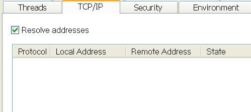

# Laboratorium 3 Analiza Dynamiczna

## TODO

> Krótki opis
> Checksums resolutions on virustotal

## Spis treści

- [Laboratorium 3 Analiza Dynamiczna](#laboratorium-3-analiza-dynamiczna)
  - [TODO](#todo)
  - [Spis treści](#spis-treści)
  - [Sumy Kontrolne](#sumy-kontrolne)
  - [Laboratorium 3.1](#laboratorium-31)
  - [Laboratorium 3.2](#laboratorium-32)
  - [Laboratorium 3.3](#laboratorium-33)
  - [Laboratorium 3.4](#laboratorium-34)

## Sumy Kontrolne

| File | Checksum SHA-256 |
| ---- | ---------------- |
| Lab03-01.exe | EB84360CA4E33B8BB60DF47AB5CE962501EF3420BC7AAB90655FD507D2FFCEDD |
| Lab03-02.dll | 5ECED7367ED63354B4ED5C556E2363514293F614C2C2EB187273381B2EF5F0F9 |
| Lab03-03.exe | AE8A1C7EB64C42EA2A04F97523EBF0844C27029EB040D910048B680F884B9DCE |
| Lab03-04.exe | 6AC06DFA543DCA43327D55A61D0AAED25F3C90CCE791E0555E3E306D47107859 |

## Laboratorium 3.1

1. Importy  
   Program nie importuje **żadnych funkcji** (poza *ExitProcess*)

2. Indykatory hostowe  
   Używając procmon, nie znalazłem **żadnej próby** połączenia z internetem.  
   Natomiast w aplikacji *procexp* zauważyłem **nowy proces Lab03-01.exe**,  
   Gdzie w właściwościach znalazłem string `www.practicalmalwareanalysis.com`
     

3. Indykatory siecowe
   W zakładce TCP/IP nie pojawiły się **żadne wpisy**
   

## Laboratorium 3.2

1. Importy

2. Instalacja
   Aby zmusić malware malware do intalacji, należy użyć komendy  
   `rundll32.exe Lab03-02.dll, installA`.  
   Komenda jest dostępna na większości systemów Windows.  
   *installA* jest to funckja pojawiająca się w importach.

3. Uruchomienie  
   Po analize programem *regshot* zauważyłem, że uruchomienie pliku spowodowało **powstanie zmian w procesie IPRIP**  
   Aby uruchomić ten proces należy użyć komendy `net start IPRIP`

4. Jak odnaleźć  
   Aby odnaleźć uruchomiony malware **zrobiłem** **shota** rejestru, a po uruchomienu procesu **zrobiłem drugiego shota**.  
   Po porównaniu zauważyłem, że dużo kluczy zostało **dodanych** i **zmodyfkowanych**.  
   
   Jednocześnie miałem włączone **przechwytywanie zdarzeń** w *procmon*.  
   Zauważyłem, że tych zmian dokonał proces ***net1.exe***.  

5. Filtr *procmon*  
   Aby wyświetlić najwięcej istotnych informacji należy dodać filtr, który zawiera wszystkie zdarzenia *net1.exe*  

6. Indykatory sieciowe  
   Używając *fakenet* przechwyciłem ruch, który próbuje wykonać proces.  
   Pojawiły się 2 strony, z którymi próbował się połączyć:  

    - `practicalmalwareanaysisi.com`  
    
    - `download.windowsupdate.com`  
    

   Druga strona nie należy do Micrsoftu i jest oznaczana przez przeglądarkę za **potencjalnie niebezpieczną**

## Laboratorium 3.3

## Laboratorium 3.4
