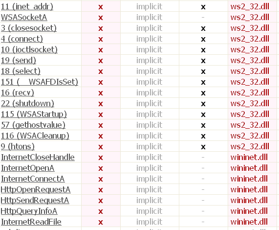
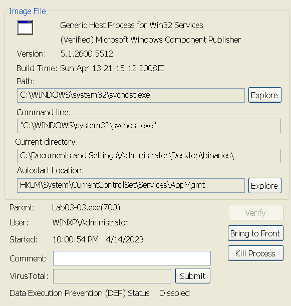
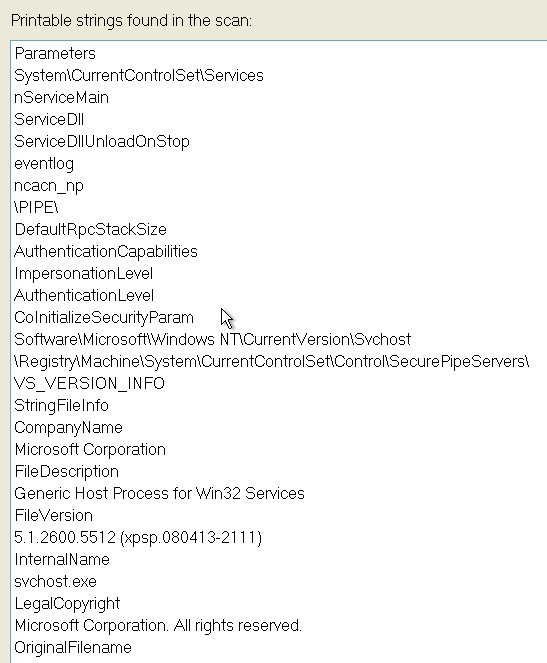
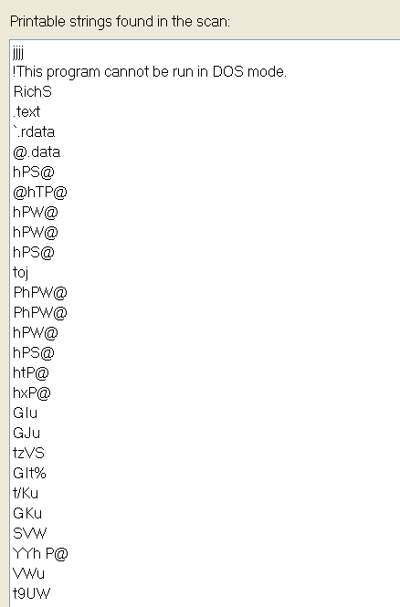
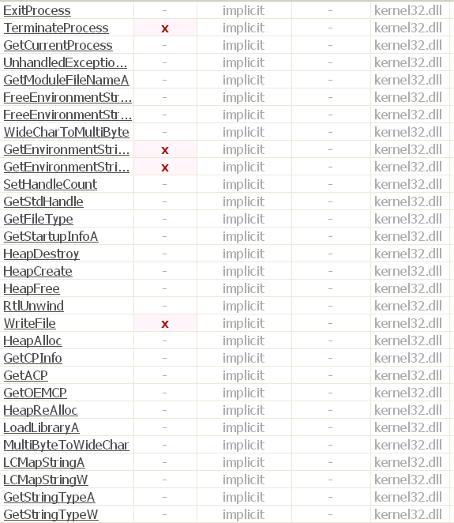
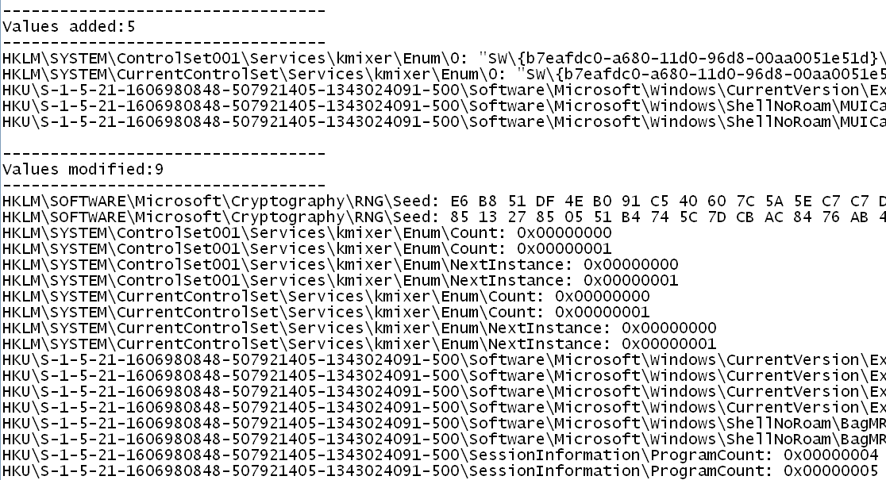

# Laboratorium 3 Analiza Dynamiczna

## Wstęp


```txt
Krótki opis 
```

## Spis treści

- [Laboratorium 3 Analiza Dynamiczna](#laboratorium-3-analiza-dynamiczna)
  - [Wstęp](#wstęp)
  - [Spis treści](#spis-treści)
  - [Sumy Kontrolne](#sumy-kontrolne)
  - [Laboratorium 3.1](#laboratorium-31)
  - [Laboratorium 3.2](#laboratorium-32)
  - [Laboratorium 3.3](#laboratorium-33)
  - [Laboratorium 3.4](#laboratorium-34)

## Sumy Kontrolne

| File | Checksum SHA-256 | Virustotal score |
| ---- | ---------------- | --- |
| Lab03-01.exe | EB84360CA4E33B8BB60DF47AB5CE962501EF3420BC7AAB90655FD507D2FFCEDD | 64/70 |
| Lab03-02.dll | 5ECED7367ED63354B4ED5C556E2363514293F614C2C2EB187273381B2EF5F0F9 | 57/69 |
| Lab03-03.exe | AE8A1C7EB64C42EA2A04F97523EBF0844C27029EB040D910048B680F884B9DCE | 61/70 |
| Lab03-04.exe | 6AC06DFA543DCA43327D55A61D0AAED25F3C90CCE791E0555E3E306D47107859 | 49/68 |

## Laboratorium 3.1

1. **Importy**  
   Program nie importuje **żadnych funkcji** (poza *ExitProcess*)

2. **Indykatory Hostowe**  
   Używając procmon, nie znalazłem **żadnej próby** połączenia z internetem.  
   Natomiast w aplikacji *procexp* zauważyłem **nowy proces Lab03-01.exe**,  
   Gdzie w właściwościach znalazłem string `www.practicalmalwareanalysis.com`
     

3. **Indykatory siecowe**  
   W zakładce TCP/IP nie pojawiły się **żadne wpisy**  
   

## Laboratorium 3.2

1. **Importy**  
   Program zawiera bardzo dużo importów z czarnej listy  
   

2. **Instalacja**  
   Aby zmusić malware malware do intalacji, należy użyć komendy  
   `rundll32.exe Lab03-02.dll, installA`.  
   Komenda jest dostępna na większości systemów Windows.  
   *installA* jest to funckja pojawiająca się w importach.

3. **Uruchomienie**  
   Po analize programem *regshot* zauważyłem, że uruchomienie pliku spowodowało **powstanie zmian w procesie IPRIP**  
   Aby uruchomić ten proces należy użyć komendy `net start IPRIP`

4. **Jak odnaleźć**  
   Aby odnaleźć uruchomiony malware **zrobiłem** **shota** rejestru, a po uruchomienu procesu **zrobiłem drugiego shota**.  
   Po porównaniu zauważyłem, że dużo kluczy zostało **dodanych** i **zmodyfkowanych**.  
   
   Jednocześnie miałem włączone **przechwytywanie zdarzeń** w *procmon*.  
   Zauważyłem, że tych zmian dokonał proces ***net1.exe***.  

5. **Filtr *procmon***  
   Aby wyświetlić najwięcej istotnych informacji należy dodać filtr, który zawiera wszystkie zdarzenia *net1.exe*  

6. **Indykatory sieciowe**  
   Używając *fakenet* przechwyciłem ruch, który próbuje wykonać proces.  
   Pojawiły się 2 strony, z którymi próbował się połączyć:  

    - `practicalmalwareanaysisi.com`  
    
    - `download.windowsupdate.com`  
    

   Druga strona nie należy do Micrsoftu i jest oznaczana przez przeglądarkę za **potencjalnie niebezpieczną**

## Laboratorium 3.3

1. **Informacje ogólne**  
   Po włączeniu programu, *procexp* wyświetlał proces tylko na chwilę, ponieważ program **bardzo szybko się wyłączał**.  
   Po naciśnięciu spacji można jednak **zatrzymać** odświeżanie i przyjżeć się bliżej.  
   Po obejrzeniu stringów nie znalazłem nic ciekawego, dlatego użyłem *procmon*, aby zobaczyć co program wykonywał.  
   Zauważyłem, że tworzy on nowy plik ***svchost.exe***  
     
   a następnie ten proces uruchamia  
     
   W *procexp* jest widoczny nie jako **usługa** (*kolor czerwony*), lecz jako **aplikacja** (*kolor niebieski*)  
   Oznaczony jest również jako proces należący do *Microsoftu*
     
   Jako folder roboczy wskazany jest katalog z wirusami. Po kliknięciu jest on również zweryfikowany jako proces *Microsoftu*, mimo że do niego nie należy  
     

2. **Modyfikacje Pamięci**  
   Po sprawdzeniu stringów okazuje się, że znacznie się one od siebie różnią:

      - **Image**  
         
      - **Memory**  
         

   Oznacza to, że instrukcje które załadowane są do pamięci są **inne niż oryginalnego procesu** należącego do systemu. Jest to **wirus podszywający się pod ten proces**

3. **Indykatory Hostowe**  
   Używając progamu *Fakenet* zauważyłem, że proces nie produkuje żadnego ruchu sieciowego  
   Po upewnieniu się w *PEstudio*, nie znalazłem żadnej importowanej funkcji związanej z siecią  
   

4. **Działanie programu**  
   Program przy włączeniu modyfikuje i tworzy kilka kluczy w rejestrach  
   Następnie tworzy nowy proces o nazwie ***svchost.exe*** podszywając się pod usłuę systemu windows utrudniając tym samym wykrycie.  
   Próba wykrycia ruchu sieciowego kończy się niepowodzeniem i patrząc na to, że program nie importuje funkcji sieciowych zakładam, że wirus nie łączy się z siecią.  
   Importuje on natomiast ponad 50 funkcji z biblioteki ***KERNEL32.DLL*** co świadczy o tym, że prawdopodobnie jego celem jest wyżądzenie szkód w systemie

## Laboratorium 3.4

1. **Ciekawe Informacje**  
   Po analizie w *PEstudio* zauważyłem ciekawe importy.  
   Znajdują się tu funkcje do manipulowania rejestrami oraz funkcje sieciowe  
     
   W stringach znajduje się adres URL `www.practicalmalwareanalysis.com`

2. **Działanie Programu**  
   Spośród zmian rejestrów, nie wykryłem nic podejrzanego  
     
   W *procexp* zauważyłem powstający proces, lecz szybko po tym został zabity. Sam program usuwa siebie samego z dysku.  
   Ruch sieciowy też nie jest produkowany.  
   Nie wykryłem w progamie, żadnych podejrzanych aktywności poza krótkim czasem działania i usuwaniem siebie z dysku.

3. **Blokada Analizy Dynamicznej**  
   Program usuwa sam siebie z dysku, przez co nie możemy włączyć go drugi raz. Sam program działa też bardzo krótko co znacznie utrudnia analizę dynamiczną'

4. **Dalsza Analiza**  
   Analiza dynamiczna na niewiele się tu zda.   Aby móc sprawdzić dokładne działanie programu potrzebna będzie zaawansowana analiza statyczna


