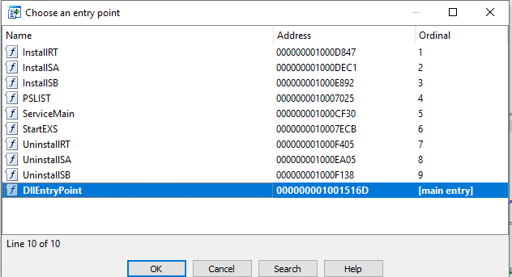
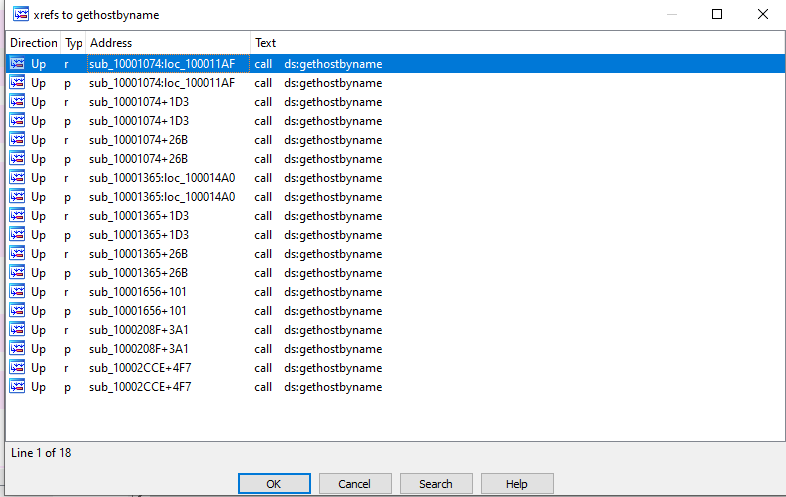

# Zaawansowana Analiza Statyczna

> TODO  
> Wstęp  
> Hashe

## Wstęp

## Table Of Contents

- [Zaawansowana Analiza Statyczna](#zaawansowana-analiza-statyczna)
  - [Wstęp](#wstęp)
  - [Table Of Contents](#table-of-contents)
  - [Hashe](#hashe)
  - [Laboratorium 4.1](#laboratorium-41)
    - [Adres DllMain](#adres-dllmain)
    - [Adres gethostbyname](#adres-gethostbyname)
    - [Wywołania gethostbyname](#wywołania-gethostbyname)
    - [DNS Request](#dns-request)
    - [Zmienne lokalne 10001656h](#zmienne-lokalne-10001656h)
    - [Parametry 10001656h](#parametry-10001656h)
  - [Laboratorium 4.2](#laboratorium-42)
  - [Laboratorium 4.3](#laboratorium-43)

## Hashe

| Plik | SHA-256 | VirusTotal |
| ---- | ------- | ---------- |
| Lab04-01.dll
| Lab04-01.py
| Lab05-01.exe
| Lab05-02.exe
| Lab05-03.exe
| Lab05-04.exe
| Lab05-05.exe

## Laboratorium 4.1

### Adres DllMain

Adres **DllMain** znajduje się na pozycji *000000001001516Dh*  
  

### Adres gethostbyname

Funkcja **gethostbyname** znajduje się pod adresem *00000000100163CCh*  
  

### Wywołania gethostbyname

Funkcja **gethostbyname** została wywołana 18 razy  
  

### DNS Request

Przed wykonaniem funkcji do rejestru jest zapisana zmienna *[This is RDO]pics.practicalmalwareanalysis.com*, a następnie została przesunięta o 0Dh  znaków, czyli 13 co daje *pics.practicalmalwareanalysis.com*  
  
  

### Zmienne lokalne 10001656h

IDA rozpoznała dla funkcji *sub_10001656* 23 zmienne lokalne (offset ujemny, ponieważ są na stacku)
  

### Parametry 10001656h

## Laboratorium 4.2

## Laboratorium 4.3
