# Zaawansowana Analiza Statyczna

> TODO  
> Wstęp  
> Hashe

## Wstęp

## Table Of Contents

- [Zaawansowana Analiza Statyczna](#zaawansowana-analiza-statyczna)
  - [Wstęp](#wstęp)
  - [Table Of Contents](#table-of-contents)
  - [Hashe](#hashe)
  - [Struct Cheatsheet](#struct-cheatsheet)
    - [if statement](#if-statement)
    - [Nested if statement](#nested-if-statement)
    - [for loop](#for-loop)
  - [Laboratorium 4.1](#laboratorium-41)
    - [Adres DllMain](#adres-dllmain)
    - [Adres gethostbyname](#adres-gethostbyname)
    - [Wywołania gethostbyname](#wywołania-gethostbyname)
    - [DNS Request](#dns-request)
    - [Zmienne lokalne 10001656h](#zmienne-lokalne-10001656h)
    - [Parametry 10001656h](#parametry-10001656h)
    - [Adres \\cmd.exe /c](#adres-cmdexe-c)
    - [Co się dzieje w otoczeniu tego adresu](#co-się-dzieje-w-otoczeniu-tego-adresu)
    - [Zmienna dword\_1008E5C4](#zmienna-dword_1008e5c4)
    - [Adres 1000FF58h](#adres-1000ff58h)
    - [Eksport PLIST](#eksport-plist)
    - [sub\_10004E79](#sub_10004e79)
    - [DllMain](#dllmain)
    - [Sleep](#sleep)
    - [Socket](#socket)
    - [in](#in)
    - [Adres 1001D988h](#adres-1001d988h)
  - [Laboratorium 4.2](#laboratorium-42)
  - [Laboratorium 4.3](#laboratorium-43)

## Hashe

| Plik | SHA-256 | VirusTotal |
| ---- | ------- | ---------- |
| Lab04-01.dll
| Lab04-01.py
| Lab05-01.exe
| Lab05-02.exe
| Lab05-03.exe
| Lab05-04.exe
| Lab05-05.exe

## Struct Cheatsheet

### if statement

Prosta struktura - porównywanie dwóch wartości, a następnie skok warunkowy

```asm
mov eax sth1
cmp eax sth2
jnz loc
```

### Nested if statement

2 zagnieżdżone ify dają 4 różne ścieżki:  

- Oba będą prawdziwe
- Tylko pierwszy będzie prawdziwy
- Tylko drugi będzie prawdziwy
- Żaden nie będzie prawdziwy

Komplikuje to strukturę kodu, lecz pojawi się sporo porównań i skoków warunkowych np.

```asm
cmp ... ...
jnz loc_1
cmp ... ...
jnz loc_2
...
jmp loc_4

loc_1:
...
loc_2:
...

...
loc_4:
*code continnues*
```

### for loop

Pętla for inicjuje wartość początkową i dopóki nie spełni się określowy warunek kod będzie skakał do tego samego miejsca (jak w pętli :P)

Przykład:

```asm
mov [ebp+var_ini], 0 ; [] oznacza lokalizację w pamięci
jmp loc_1

loc_2: ; inkrementacja
mov eax, [ebp+var_ini]
add eax, 1
mov [ebp+var_ini], eax

loc_1: ; kod w pętli
cmp [ebp+var], 20h ; wartość końcowa
jge loc_3
...
jmp loc_2
```

## Laboratorium 4.1

### Adres DllMain

IDA Free nie potrafi rozpoznać funnkcji **DllMain** a jedynie **DllEntryPoint**
Adres **DllMain** znajduje się na pozycji *000000001001516Dh*  
Aby odnaleźć **DllMain** trzeba załadować plik FLIRT, a dokładniej *vc32rtf*  
Po sprawdzeniu zakładki *Function Calls* widać kilka funkcji z czego tylko 2 rzeczy nie są *library function*  
*dword_10092E58* jest tylko pointerem, więc DllMain musi być funkcja ***sub_1000D02E***, która znajduje się właśnie pod tym adresem  


  

  

Po zmianie nazwy funkcji wygląda ona teraz tak:  

  

### Adres gethostbyname

Funkcja **gethostbyname** znajduje się pod adresem *00000000100163CCh*  

  

### Wywołania gethostbyname

Funkcja **gethostbyname** została wywołana 18 razy  

  

### DNS Request

Przed wykonaniem funkcji do rejestru jest zapisana zmienna *[This is RDO]pics.practicalmalwareanalysis.com*, a następnie została przesunięta o 0Dh  znaków, czyli 13 co daje ***pics.practicalmalwareanalysis.com***  

  

  

### Zmienne lokalne 10001656h

IDA rozpoznała dla funkcji *sub_10001656* **23** zmienne lokalne (offset ujemny, ponieważ są znajdują się pod EBP. Zmienne lokalne zapisywane są na stacku po zmianie EBP przy wywołaniu funkcji więc znajdują się wyżej)  

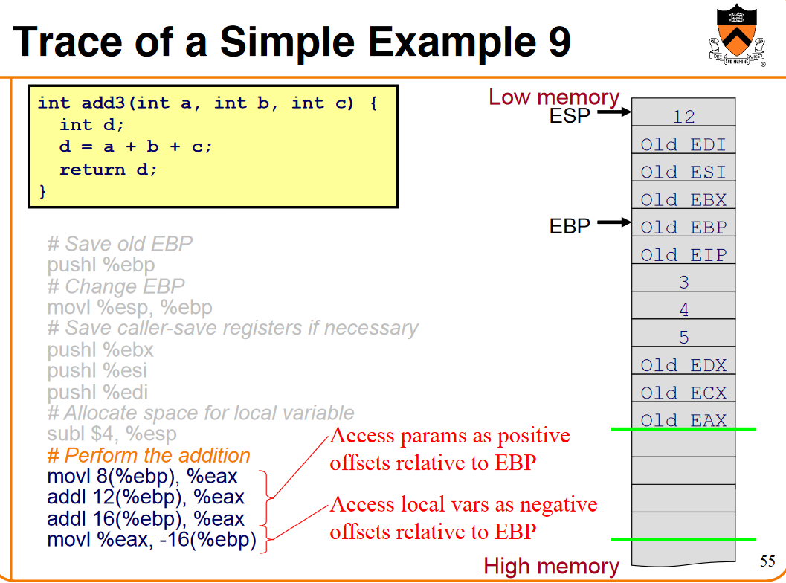  

### Parametry 10001656h

Funkcja *sub_10001656* posiada **jeden** parametr (offset dodatni)

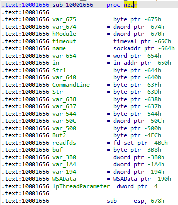  

### Adres \cmd.exe /c

String *\cmd.exe /c* znajduje się pod adresem **10095B34**

### Co się dzieje w otoczeniu tego adresu

Przeglądając graf na samym początku tej funkcji znajduje się duży string, który zawiera wiadomość. Znajdują się w niej informacje o ***szyfrowaniu magicznego numeru (Encrypt Magic Number)*** oraz ***Remote Shell Session***  

  

Program porównuje wersje systemu i w zależności od niej wywołuje *\cmd.exe /c* lub */command.exe /c*  

  

dwPlatformId równe 2 oznacza VER_PLATFORM_WIN32_NT co oznacza, że system jest Windows NT lub nowszy  

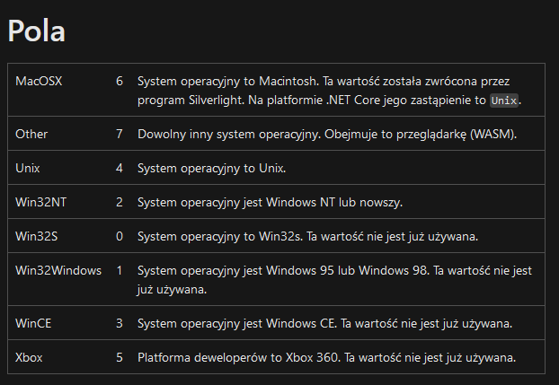  

  

*/c* jako opcja oznacza, że wykona się komenda podana w stringu  
Program łączy stringi za pomocą funkcji ***strcat***  

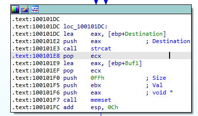  

Dalej w funkcji znajdują się stringi takie jak:

- quit
- exit
- cd
- enmagic
- language
- install
- host
- inject

Najprawdopodbniej są to komendy, ze wzglęgu na wcześniejszą wiadomość z ***Remote Shell Session***

### Zmienna dword_1008E5C4

Zmienna dword_1008E5C4 została opisana [powyżej](#co-się-dzieje-w-otoczeniu-tego-adresu)

### Adres 1000FF58h

Jeżeli porównanie *'robotwork'* zwróci zero (eax będzie miało tą samą wartość) skok warunkowy nie wykona się i program będzie wykonywał się dalej (w tym przypadku pójdzie ścieżką czerwoną w lewo)  

  

Wykona się tam funkcja *sub100052A2*, która przyjmuje socket jako argument  

  

Funkcja ta wykonuje następujące operacje:

- Otwiera rejestr ***HKLM\SOFTWARE\Microsoft\Windows\CurrentVersion***
- Następnie klucz Worktime/Worktimes
- Z tego klucza wyciąga informacje i wysyła je zdalnemu hostowi za pomocą funkcji *sub_100038EE*

  

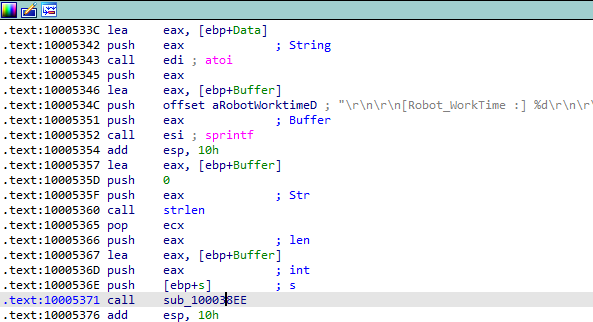  

### Eksport PLIST

Na początku funkcja sprawdza wersję systemu, lecz tym razem sprawdzając czy Majorversion jest większa niż 5 (czyli wersja nowsza lub równa Windows 2000)

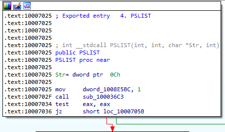  

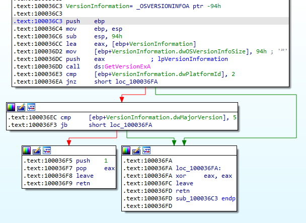  

W tym miejscu funkcja sprawdza, czy jako parametr został podany string. W obu przypadkach obie funkcje enumerują Wszystkie atywne procesy. Na początku wykonuje snapshot procesów za pomocą ***CreateToolhelp32Snapshot***,  

  

***Process32First***, aby wyciągnąć ze snapshota pierwszy proces, a następnie w pętli while ***Process32Next***.  

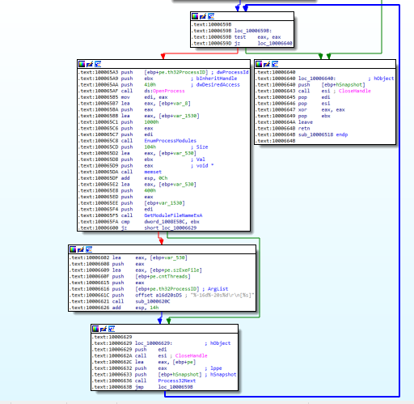  

Funkcja pozyskuje również informacje o tym do jakiego pliku należy dany proces za pomocą ***GetModuleFileNameEx***, wszystko w czytelnym formacie  

  

### sub_10004E79

Funkcja wywołuje funkcję ***GetSystemDefaultLangID***, która zwraca ID domyślnie ustawionego języka systemowego, a następnie go wysyła zdalnemu hostowi  

  

Wszystkie ID są rozpisane przez Microsoft [tutaj](https://winprotocoldoc.blob.core.windows.net/productionwindowsarchives/MS-LCID/%5bMS-LCID%5d.pdf)  
Dla przykładu język polski ma przypisane ID **0x0015** lub **0x0415**, a angielski **0x0009**, **0x0409** (odmiana amerykańska) lub **0x0809** (odmiana brytyjska) itd.  

Funkcja mogłaby przyjąć nazwę ***SendDefaultLangID*** bądź ***RetrieveDefaultLangID***

### DllMain

Aby dowiedzieć się ile wywołań ma *DllMain* najlepszym rozwiązaniem jest stworzenie grafu np. z takimi ustawieniami:  

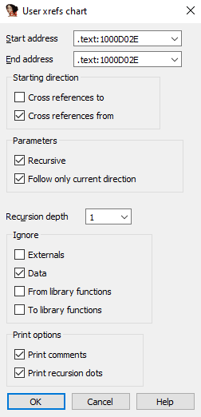  

DllMain używa bezpośrednio 7 funkcji:

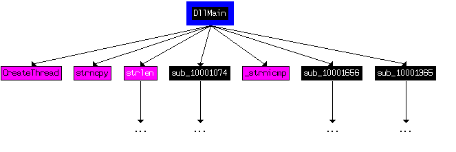

Używając głębokości 2 (Jeżeli nie popełniłem błędu w liczeniu) używa 66 funkcji:


### Sleep

Przed wywołaniem funkcji najpierw musi ona przyjąć parametry. Dzieje się to za pomocą *push*. Musimy w takim razie sprawdzić jaką wartość będzie miał rejestr **eax**.

Zaczyna się od tego, że do rejestru eax zapisana jest offset stringa *"[This is CTI]30"*.

Do offsetu następnie jest dodana wartość 0Dh (13 base 10) co sprawia, że string to teraz *"30"*.

push eax wrzuca eax na stack, gdzie następnie jest wywołana funkcja *atoi*, która w języku c++ zamienia string na liczbę. Tak więc funckja zwraca wartość 30. Według poniższej tabelki eax jest pierwszym rejestrem, który przychowuje pierwszą zwróconą wartość.

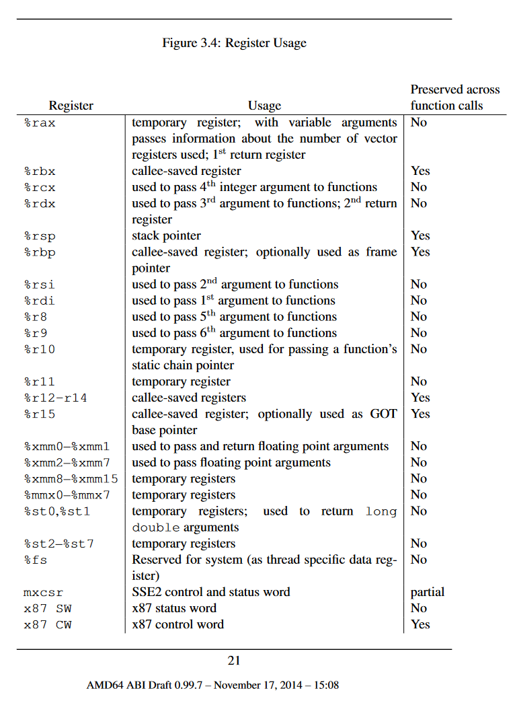

Następnie wartość zostaje pomnożona przez 3E8h (3 \* 16^2 + 14 \* 16 + 8) czyli 1000.

Ta wartość jest przyjmowana jako parametr przez funckcję sleep, która przyjmuje czas w milisekundach. To oznacza, że program śpi przez ***30 sekund***

### Socket

Funkcja Socek przyjmuje 3 parametry:

- int af
- int type
- int protocol

Według dokumentacji Microsoft  
af oznacza address family
type oznacza typ socketa
protocol oznacza użyty protokół

W tym miejscu odwołanie w pseudo C/C++ wyglądało by tak:

```C
socket(2, 1, 6)
```

Co oznacza utworzony socket z address family AF_INET (Adres IPv4), type SOCK_STREAM (Two way connection, przy AF_INET TCP) i protokołem IPPROTO_TCP

### in

Po wyszukaniu każdej linii zawierającej EDh znalazłem tylko jeden adres w którym została użyta funkcja `in`


Funckcja `in` używa dwóch rejestrów: *eax* (Magic Value) oraz *dx* (port)

Po kliknięciu na wartość *564D5868h* i kliknięciu klawisza R ukazuje nam się string VMXh, a w *edx* VX.

Po instrukcji `in` jest instrukcja `cmp ebx, 'VMXh'`, która sprawdza czy otrzymano odpowiedź od portu VMware.

Program jest zatem w stanie wykryć obecność w maszynie wirtualnej

Po wykonaniu funkcji znajduje się też string *Found Virtual Machine,Install Cancel.*

### Adres 1001D988h

Pod tym adresem znajdują się losowe dane. Jednak w książce odpowiednik tego zadania wskazuje na użycie skryptu w pythonie. Niestety w IDA Free nie da się używać takich skryptów. Skrypt jedyne co robi to xoruje każdy znak z 55h, więc zrobiłem to ręcznie używając [Cyberchef](https://cyberchef.org/#recipe=From_Hex('Auto')XOR(%7B'option':'Hex','string':'55'%7D,'Standard',false)&input=MkQgMzEgM2EgM2EgMjcgNzUgCjNjIDI2IDc1IDIxIDNkIDNjIDI2IDc1IAozNyAzNCAzNiAzZSAzMSAzYSAzYSAyNyA3OSA3NSAKMjYgMjEgMjcgM2MgM2IgMzIgNzUgCjMxIDMwIDM2IDNhIDMxIDMwIDMxIDc1IAozMyAzYSAyNyA3NSAwNSAyNyAzNCAzNiAyMSAzYyAzNiAzNCAzOSA3NSAKMTggMzQgMzkgMjIgMzQgMjcgMzAgNzUgCjE0IDNiIDM0IDM5IDJjIDI2IDNjIDI2IDc1IAoxOSAzNCAzNyA3NSAKNmYgN2MgNjQgNjcgNjYgNjE)

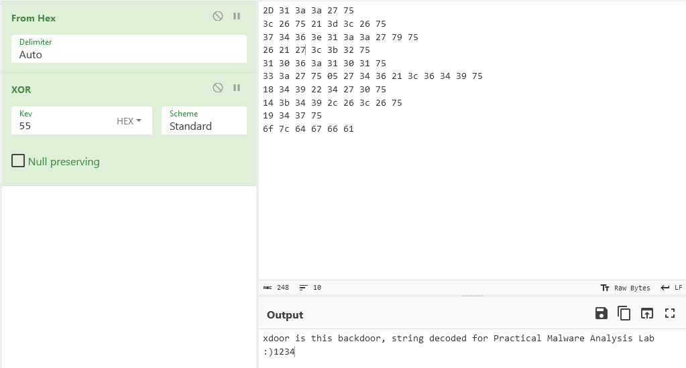

## Laboratorium 4.2

## Laboratorium 4.3
