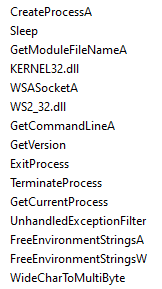
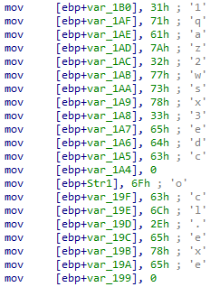
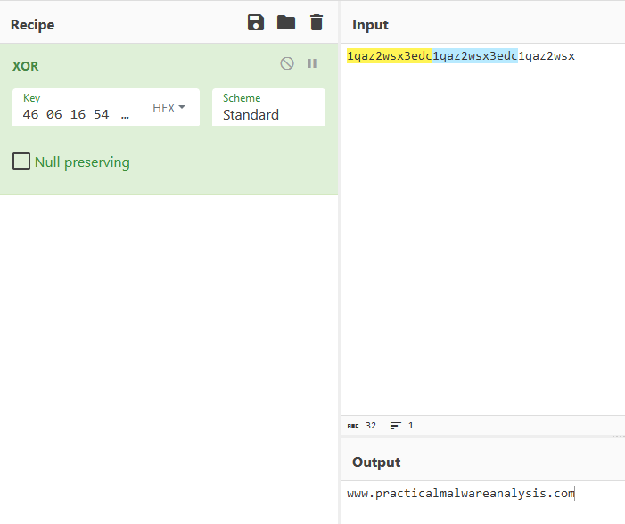
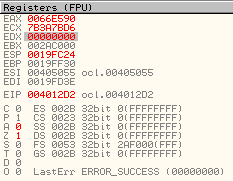

# Laboratorium 5

## TODO

## Wstęp

## Hashe

## Spis treści

- [Laboratorium 5](#laboratorium-5)
  - [TODO](#todo)
  - [Wstęp](#wstęp)
  - [Hashe](#hashe)
  - [Spis treści](#spis-treści)
  - [Laboratorium 5.1](#laboratorium-51)
    - [Funkcja main](#funkcja-main)
    - [W jaki sposób zmusić malware do instalacji](#w-jaki-sposób-zmusić-malware-do-instalacji)
    - [Jakie są wymagania dotyczące hasła?](#jakie-są-wymagania-dotyczące-hasła)
    - [Podaj argumenty wiersza poleceń dla tego programu](#podaj-argumenty-wiersza-poleceń-dla-tego-programu)
    - [Jak można wykorzystać OllyDbg do wprowadzenia zmian w tym malware, aby nie wymagał podawania hasła w wierszu poleceń?](#jak-można-wykorzystać-ollydbg-do-wprowadzenia-zmian-w-tym-malware-aby-nie-wymagał-podawania-hasła-w-wierszu-poleceń)
    - [Indykatory hostowe](#indykatory-hostowe)
    - [Działanie](#działanie)
      - [-in](#-in)
      - [-re](#-re)
      - [-cc](#-cc)
      - [Bez opcji](#bez-opcji)
    - [Podsumowanie](#podsumowanie)
  - [Laboratorium 5.2](#laboratorium-52)
    - [Przeanalizuj i wypisz łańcuchy znaków, które jesteśmy w stanie odszukać w pliku](#przeanalizuj-i-wypisz-łańcuchy-znaków-które-jesteśmy-w-stanie-odszukać-w-pliku)
    - [Opisz wynik działania z uruchomienia pliku](#opisz-wynik-działania-z-uruchomienia-pliku)
    - [W jaki sposób zmusić analizowany plik do uruchomienia swojej szkodliwej zawartości?](#w-jaki-sposób-zmusić-analizowany-plik-do-uruchomienia-swojej-szkodliwej-zawartości)
    - [Opisz działanie znajdującej się pod adresem 0x00401133](#opisz-działanie-znajdującej-się-pod-adresem-0x00401133)
    - [Podaj argumenty, które są przekazywane do podprogramu pod adresem 0x00401089?](#podaj-argumenty-które-są-przekazywane-do-podprogramu-pod-adresem-0x00401089)
    - [Podaj nazwę domeny, która wykorzystuje ten malware](#podaj-nazwę-domeny-która-wykorzystuje-ten-malware)
    - [Jaka procedura kodowania została zastosowana przez ten program do zaciemnienia nazwy domeny?](#jaka-procedura-kodowania-została-zastosowana-przez-ten-program-do-zaciemnienia-nazwy-domeny)
    - [Opisz znaczenie wywołania CreateProcessA znajdującego się pod adresem 0x0040106E w nawiązaniu do tego malware?](#opisz-znaczenie-wywołania-createprocessa-znajdującego-się-pod-adresem-0x0040106e-w-nawiązaniu-do-tego-malware)
  - [Laboratorium 5.3](#laboratorium-53)

## Laboratorium 5.1

### Funkcja main

Zanim zacząłem analizę dynamiczną, załadowałem program do *IDA* w celu znalezienia funkcji `main`.

Po analizie już kilku programów PE jestem w stanie szybko rozpoznać kod generowany przez kompilator oraz zlokalizować funkcję `main`.

Funkcja `main` znajduje się pod adresem **403945h**

W OllyDbg ustawiłem breakpoint na ten właśnie adres


### W jaki sposób zmusić malware do instalacji

Po spojrzeniu do środka funkcji `main` na początku sprawdzane jest czy argc jest różne od 1.

Jeżeli jest (program zostanie włączony bez dodatkowych argumentów) program wywołuje funckję `GetShortPathNameA` oraz konkatenuje zwróconą wartość z *"/c del"*. Program próbuje usnunąć sam siebie.


Dlatego trzeba podać dodatkowe argumenty. Podając losowy argument wraz ze startem programu, program wykonuje się dalej, lecz sprawdzane jest czy podany argument ma składa się z 4 znaków (nie licząc 0h).

### Jakie są wymagania dotyczące hasła?

Podałem 4-znakowy argument "1234" i sprawdziłem co dzieje się dalej. Program sprawdza czy pierwszy znak to literka "a". Znaki się nie zgadzały, więc program próbował usnunąć siebie samego.


Sprawdzanie drugiej literki jest odrobinę zaciemnione. Do rejestrów dodawane są wskaźniki do różnych stringów, lecz te stringi nie biorą udziału w sprawdzaniu. Przeprowadzane są operacje na ostatnim bajcie tych wskaźników, które sprowadzają się do odjęcia pierwszego znaku od drugiego, a następnie sprawdzenie czy różnica jest równa 1. To znaczy, że drugi znak to literka *"b"*.

`ECX` trzyma wartość FFFFFFD1, bo $32 - 61 = -29$ czyli D1h.  
Znak nie ma znaczenia, ponieważ zmienia to jedynie stan S (sign)


3 znak jest porównywany z literką *"c"*


Ostatnia litera to *"d"*, a więc hasło to *"abcd"*

### Podaj argumenty wiersza poleceń dla tego programu

Używając IDA w funkcji main znalazłem argumenty takie jak:

- -in
- -re
- -c
- -cc

### Jak można wykorzystać OllyDbg do wprowadzenia zmian w tym malware, aby nie wymagał podawania hasła w wierszu poleceń?

Aby pominąć sprawdzanie hasła, można użyć polecenia JMP w taki sposób

```x86asm
PUSH  EBP       ; początek funkcji
MOV   EBP, ESP
PUSH  ECX
PUSH  EDI
JMP   0040259B  ; dodana funkcja przeze mnie

...             ; pominięty kod

MOV   EAX, 1    ; powrót do funkcji main
POP   EDI
MOV   ESP, EBP
POP   EBP
RETN             
```

Następnie wprowadzam zmiany trwale i zapisuję je w drugim pliku

### Indykatory hostowe

- `http://www.practicalmalwareanalysis.com`
- HTTP/1.0\r\n\r\n
- DOWNLOAD
- UPLOAD

### Działanie

#### -in

Malware tworzy usługę o nazwie pliku, z którego został uruchomiony

Dodaje tą usługę do autostartu pod nazwą *Lab06-01 Manager Service*

Program następnie kopiuje siebie do **C:\Windows\system32\Lab06-01.exe** (*w zależności gdzie znajduje się katalog systemowy*)

Program zmienia czas stworzenia pliku *C:\Windows\system32\Lab06-01.exe* na taki sam jak kernel32.dll, aby nie wyglądał podejrzanie. Malware próbuje się ukryć w folderze systemowym.

Malware tworzy klucz w rejestrze *SOFTWARE\Microsoft \\XPS* (spacja ma znaczenie, ponieważ będzie trakowany jako zupełnie inny podfolder niż Microsoft bez spacji) oraz tworzy klucz *Configuration*, do którego zapisane są stringi *`http://practicalmalwareanalysis.com`*, *80* i *60*

Malware kończy pracę


#### -re

Program z tą opcją wygląda prawie tak samo, ale zamiast tworzyć plik to go usuwa.

Można wysunąć wnioski, że *-in* stoi za *install*, a *-re* za *remove*

#### -cc

Program włączony z tą opcją odczytuje zawartość klucza rejestru *SOFTWARE\Microsoft \XPS* Configure i wypisuje je sformatowane do terminala


#### Bez opcji

Zanim malware się usunie, sprawdza, czy klucz rejestru istnieje. Jeżeli tak to działa zupełnie inaczej.

Moja maszyna nie jest połączona z internetem, dlatego program kończy swoje działanie wcześniej. Analizując program w IDA, widzę, że program próbuje dostać się na stronę internetową *`http://practicalmalwareanalysis.com`*. Dalej w programie pojawiają się różne stringi takie jak *SLEEP*, *DOWNLOAD*, *UPLOAD*. Podejrzewam, że w zależności od zawartości strony, będzie wykonywało różne funkcje, które odpowiadają wyżej wymienionym stringom.

### Podsumowanie

Na podstawie działania programu stwierdzam, że jest to backdoor.

Instaluje się w systemie, ukrywa się w folderze systemowym oraz tworzy serwis z autostartem.

## Laboratorium 5.2

### Przeanalizuj i wypisz łańcuchy znaków, które jesteśmy w stanie odszukać w pliku

W zakładce *strings* nie ma żadnych ciekawych strigów, poza importami.

Natomiast po pierwszym spojrzeniu na funkcję `main` rzuca się w oczy lista pojedynczych znaków. Prawdopodobnie mogą być wykorzystane jako stringi:

- *1qaz2wsx3edc*
- *ocl.exe*

Pierwszy nic nie mówi, ponieważ może być zakodowany, lub znaki mogą mieć inne zastosowanie. Drugi zaś wygląda na nazwę programu wykonywalnego.

Patrząc jednak na to, ze stringi wrzucane są na stack bez odstępów, najbardziej prawdopodobną opcją jest zakodowany string. Wskazuje na to też bajt 0h na końcu obu stringów.





### Opisz wynik działania z uruchomienia pliku

Pierwsze uruchomienie zrobiło prawie nic. Najważniejszy jest skok pod koniec funkcji `main`, który warunkowany jest sprawdzeniem czy nazwa programu to ***ocl.exe***.

### W jaki sposób zmusić analizowany plik do uruchomienia swojej szkodliwej zawartości?

Po zmianie nazwy debugowanego pliku na *ocl.exe* program objął inną ścieżkę.

### Opisz działanie znajdującej się pod adresem 0x00401133

Na stack ładowane są znaki, z 0x0 na końcu co najprawdopodobniej wskazuje na to, że jest to string (możliwe, że zakodowany, ponieważ nie przedstawia żadnego sensownego słowa)

### Podaj argumenty, które są przekazywane do podprogramu pod adresem 0x00401089?

Funkcja ma w sobie pętlę oraz funkcję *_strlen*. Przyjmuje jako jeden z argumentów adres **[ebp+1B0]** czyli pierwszy znak zakodowanego stringa. Drugi argument to jakiś adres ???


### Podaj nazwę domeny, która wykorzystuje ten malware

W pętli wykonywały się różne operacje na zakodowanym stringu takie jak idiv i xor. Po wykonanej pętli otrzymujemy string *`www.practicalmalwareanalysis.com`*


### Jaka procedura kodowania została zastosowana przez ten program do zaciemnienia nazwy domeny?

Działanie funckji:

Funkcja przyjmuje 2 tablice znaków. Piersza tablica to string *1qaz2wsx3edc*, a druga (znajdująca się na stercie pod wirtualnym adresem 0x19FD40)

*46 06 16 54 42 05 12 1B 47 0C 07 02 5D 1C 00 16 45 16 01 1d 52 0b 05 0f 48 02 08 09 1c 14 1c 15* (hex)

Następnie jest pętla while, która iteruje 0x20 razy (32) czyli tyle ile ma druga tablica.

W pętli na obu stringach jest przeprowadzana operacja XOR znak po znaku.

Do tego jest operacja idiv, która tu ma zastosowanie modulo. Pierwszy string jest krótszy, więc po ostatnim znaku, znaki pierwszego stringa XORowane są od początku.

Wygląda do mniej więcej tak:



### Opisz znaczenie wywołania CreateProcessA znajdującego się pod adresem 0x0040106E w nawiązaniu do tego malware?

Malware próbuje otrzymać adres strony *`www.practicalmalwareanalysis.com`*. Maszyna nie jest podłączona do sieci więc program zamyka socket, a następnie śpi przez 30 sekund. Natstępnie próbuje wykonać wcześniejszą operację jeszcze raz.


Użyłem więc narzędzia FakeNet-NG, aby malware myślał, że jest połączony z siecią.

Program pomyślnie wysłał zapytanie DNS i nie zwrócił błędu.




Niestety nie udało mi się skonfigurować FakeNet w taki sposób, aby połączenie się udało, dlatego po funkcji `connect` zmodyfikowałem rejestr *eax*, aby program myślał, że połączenie się udało.

Przed wykonaniem CreateProcessA widać manipulację strukturą StartupInfo

Ustawione są flagi 0x101, czyli input może przyjmować handle. Do tej struktury jest podany handle połączenia sieciowego.

ShowWindow jest ustawione na 0, przez co nie będzie widać okienka podczas tworzenia procesu.

Utowrzony proces to cmd, który jako input może przyjmować polecenia przesyłane przez internet

Na koniec program oczekuje na przyjęcie inputu. Nie przestanie się wykonywać dopóki go nie otrzyma (INFINITE time-out interval ).


## Laboratorium 5.3
