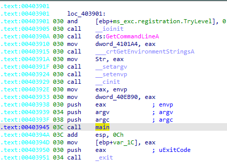
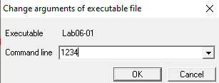

# Laboratorium 5

## TODO

## Wstęp

## Hashe

## Spis treści

- [Laboratorium 5](#laboratorium-5)
  - [TODO](#todo)
  - [Wstęp](#wstęp)
  - [Hashe](#hashe)
  - [Spis treści](#spis-treści)
  - [Laboratorium 5.1](#laboratorium-51)
    - [Funkcja main](#funkcja-main)
    - [W jaki sposób zmusić malware do instalacji](#w-jaki-sposób-zmusić-malware-do-instalacji)
    - [Jakie są wymagania dotyczące hasła?](#jakie-są-wymagania-dotyczące-hasła)
    - [Podaj argumenty wiersza poleceń dla tego programu](#podaj-argumenty-wiersza-poleceń-dla-tego-programu)
    - [Jak można wykorzystać OllyDbg do wprowadzenia zmian w tym malware, aby nie wymagał podawania hasła w wierszu poleceń?](#jak-można-wykorzystać-ollydbg-do-wprowadzenia-zmian-w-tym-malware-aby-nie-wymagał-podawania-hasła-w-wierszu-poleceń)
    - [Indykatory hostowe](#indykatory-hostowe)
    - [Działanie](#działanie)
      - [-in](#-in)
      - [-re](#-re)
      - [-cc](#-cc)
      - [Bez opcji](#bez-opcji)
    - [Podsumowanie](#podsumowanie)
  - [Laboratorium 5.2](#laboratorium-52)
  - [Laboratorium 5.3](#laboratorium-53)

## Laboratorium 5.1

### Funkcja main

Zanim zacząłem analizę dynamiczną, załadowałem program do *IDA* w celu znalezienia funkcji `main`.

Po analizie już kilku programów PE jestem w stanie szybko rozpoznać kod generowany przez kompilator oraz zlokalizować funkcję `main`.

Funkcja `main` znajduje się pod adresem **403945h**

W OllyDbg ustawiłem breakpoint na ten właśnie adres




### W jaki sposób zmusić malware do instalacji

Po spojrzeniu do środka funkcji `main` na początku sprawdzane jest czy argc jest różne od 1.

Jeżeli jest (program zostanie włączony bez dodatkowych argumentów) program wywołuje funckję `GetShortPathNameA` oraz konkatenuje zwróconą wartość z *"/c del"*. Program próbuje usnunąć sam siebie.


Dlatego trzeba podać dodatkowe argumenty. Podając losowy argument wraz ze startem programu, program wykonuje się dalej, lecz sprawdzane jest czy podany argument ma składa się z 4 znaków (nie licząc 0h).

### Jakie są wymagania dotyczące hasła?

Podałem 4-znakowy argument "1234" i sprawdziłem co dzieje się dalej. Program sprawdza czy pierwszy znak to literka "a". Znaki się nie zgadzały, więc program próbował usnunąć siebie samego.




Sprawdzanie drugiej literki jest odrobinę zaciemnione. Do rejestrów dodawane są wskaźniki do różnych stringów, lecz te stringi nie biorą udziału w sprawdzaniu. Przeprowadzane są operacje na ostatnim bajcie tych wskaźników, które sprowadzają się do odjęcia pierwszego znaku od drugiego, a następnie sprawdzenie czy różnica jest równa 1. To znaczy, że drugi znak to literka *"b"*.

`ECX` trzyma wartość FFFFFFD1, bo $32 - 61 = -29$ czyli D1h.  
Znak nie ma znaczenia, ponieważ zmienia to jedynie stan S (sign)


3 znak jest porównywany z literką *"c"*


Ostatnia litera to *"d"*, a więc hasło to *"abcd"*

### Podaj argumenty wiersza poleceń dla tego programu

Używając IDA w funkcji main znalazłem argumenty takie jak:

- -in
- -re
- -c
- -cc

### Jak można wykorzystać OllyDbg do wprowadzenia zmian w tym malware, aby nie wymagał podawania hasła w wierszu poleceń?

Aby pominąć sprawdzanie hasła, można użyć polecenia JMP w taki sposób

```x86asm
PUSH  EBP       ; początek funkcji
MOV   EBP, ESP
PUSH  ECX
PUSH  EDI
JMP   0040259B  ; dodana funkcja przeze mnie

...             ; pominięty kod

MOV   EAX, 1    ; powrót do funkcji main
POP   EDI
MOV   ESP, EBP
POP   EBP
RETN             
```

Następnie wprowadzam zmiany trwale i zapisuję je w drugim pliku

### Indykatory hostowe

- `http://www.practicalmalwareanalysis.com`
- HTTP/1.0\r\n\r\n
- DOWNLOAD
- UPLOAD

### Działanie

#### -in

Malware tworzy usługę o nazwie pliku, z którego został uruchomiony

Dodaje tą usługę do autostartu pod nazwą *Lab06-01 Manager Service*

Program następnie kopiuje siebie do **C:\Windows\system32\Lab06-01.exe** (*w zależności gdzie znajduje się katalog systemowy*)

Program zmienia czas stworzenia pliku *C:\Windows\system32\Lab06-01.exe* na taki sam jak kernel32.dll, aby nie wyglądał podejrzanie. Malware próbuje się ukryć w folderze systemowym.

Malware tworzy klucz w rejestrze *SOFTWARE\Microsoft \\XPS* (spacja ma znaczenie, ponieważ będzie trakowany jako zupełnie inny podfolder niż Microsoft bez spacji) oraz tworzy klucz *Configuration*, do którego zapisane są stringi *`http://practicalmalwareanalysis.com`*, *80* i *60*

Malware kończy pracę


#### -re

Program z tą opcją wygląda prawie tak samo, ale zamiast tworzyć plik to go usuwa.

Można wysunąć wnioski, że *-in* stoi za *install*, a *-re* za *remove*

#### -cc

Program włączony z tą opcją odczytuje zawartość klucza rejestru *SOFTWARE\Microsoft \XPS* Configure i wypisuje je sformatowane do terminala


#### Bez opcji

Zanim malware się usunie, sprawdza, czy klucz rejestru istnieje. Jeżeli tak to działa zupełnie inaczej.

Moja maszyna nie jest połączona z internetem, dlatego program kończy swoje działanie wcześniej. Analizując program w IDA, widzę, że program próbuje dostać się na stronę internetową *`http://practicalmalwareanalysis.com`*. Dalej w programie pojawiają się różne stringi takie jak *SLEEP*, *DOWNLOAD*, *UPLOAD*. Podejrzewam, że w zależności od zawartości strony, będzie wykonywało różne funkcje, które odpowiadają wyżej wymienionym stringom.

### Podsumowanie

Na podstawie działania programu stwierdzam, że jest to backdoor.

Instaluje się w systemie, ukrywa się w folderze systemowym oraz tworzy serwis z autostartem

## Laboratorium 5.2

## Laboratorium 5.3
